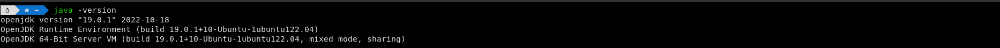
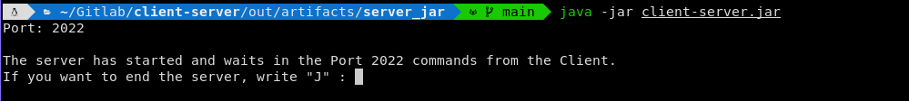
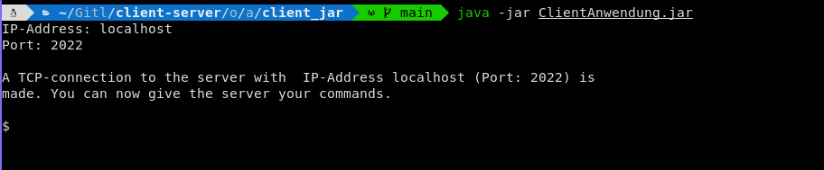
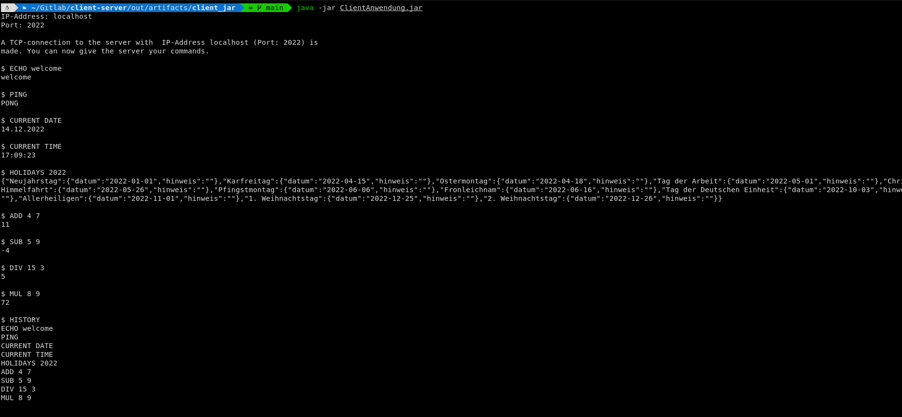
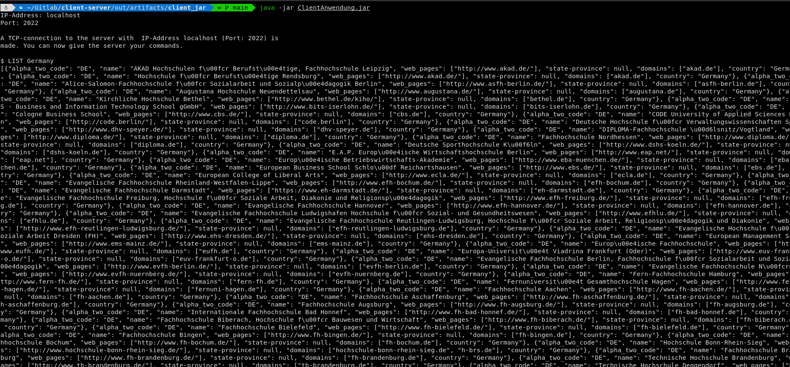

# Client-Server-Project

(  This project is implemented using  _**JDK 19**_  )

##  General Info

With this project you can interact with a **local server** on your PC that receives a command from the **client** and gives back some informations or results.

You can run the code using an **IDE** (for example:  [_IntelliJ IDEA_](https://www.jetbrains.com/idea/) from JetBrains ). If you want to use the **terminal** (  for **GNU/Linux** or **MacOS**  ) or the command prompt (  for **Windows**  ), you have to install the _**JRE 19**_.


### Java version

To check the java version using the terminal : 

```
$ java -version
```

You should get something similar to this : 



### JRE installation 

To install _**JRE 19**_ using the terminal, use the following command :


**Debian/Ubuntu**
```
$ sudo apt install openjdk-19-jre 
```

**Arch Linux**
```
$ sudo pacman -S jre-openjdk
```

**Fedora**
```
$ sudo dnf install -y java-19-openjdk
```

**OpenSuse**
```
$ sudo zypper --non-interactive install java-19-openjdk
```

## First steps

In order to use this project the right way and see how izt functions, you need to follow the following steps :

1. Connect to the local server using port-number **2022** (  other port-numbers won´t be accepted  )



2. Connect the client with the server : 

   * Ip-Address : **localhost** or **127.0.0.1**
   * Port : **2022**



3. As a client give one of the following commands and you will get some information from the server depending on which command is passed on : 

Command  | Output | Command | Output                    
------------- | -------------- | ------------ | -----------
ECHO _message_  | _message_ | HISTORY | all given commands
CURRENT TIME  | the current time (  _format :_ **HH:mm:ss**  )| HISTORY **_k_** | the last **_k_** given commands. If **_k_** > the number of all given commands, you will get all guven commands.
CURRENT DATE  | the current date (  _format :_ **dd.MM.yyyy**)| LIST _country_ | a list of all universities in the given _country_ 
ADD _num1 num2_ | _num1_ + _num2_ | LATEST NEWS | the latest news using an API GET request from [tagesschau](https://www.tagesschau.de/api2/)
SUB _num1 num2_ | _num1_ - _num2_ | HOLIDAYS **_x_** | all the holidays in Germany in year **_x_**
MUL _num1 num2_ | _num1_ * _num2_ | PING | PONG
DIV _num1 num2_ | _num1_ / _num2_ | others | ERROR


* Some examples :


* List all universities in Germany : 

